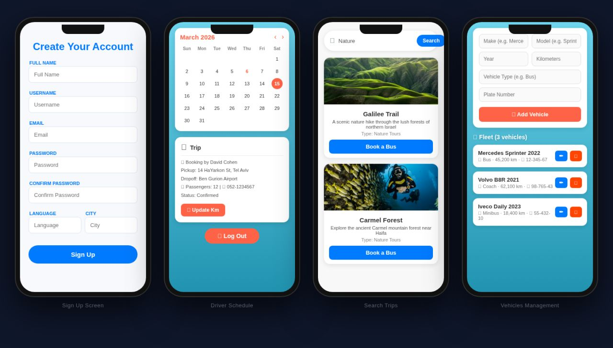
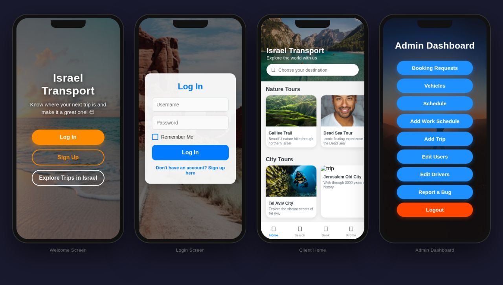

# Israel Transport 🚌

Israel Transport is a full-stack mobile application for managing transportation, tourism trips, bookings, drivers, schedules, vehicles, and admin operations in Israel.

The project was developed as an academic final project for Ruppin Academic Center and demonstrates a real-world mobile app architecture with a React Native frontend, a Node.js/Express backend, MongoDB Atlas, Cloudinary image uploads, and email verification.

## Screenshots

### App Screens






## Main Features

- User authentication: login, sign up, persistent login, and email verification
- Client experience: browse trips, search by type, and book transportation
- Driver dashboard: view assigned schedule and update kilometers
- Vehicle management: add, edit, delete, and manage fleet vehicles
- Admin dashboard: manage bookings, vehicles, schedules, trips, users, drivers, and reports
- Trip management: create and display nature tours, city tours, and destination-based trips
- Bug reporting system for users and admins
- Image upload support using Cloudinary
- REST API backend deployed online

## Project Structure

```text
IsraelTransport/
├── frontend/   # React Native mobile app using Expo
└── backend/    # Node.js REST API using Express and MongoDB
```

## Frontend

The frontend is a mobile application built with React Native and Expo, targeting Android and iOS.

### Frontend Tech Stack

- React Native 0.74
- Expo SDK ~51
- React Navigation: stack navigation and bottom tabs
- Axios for API requests
- AsyncStorage for persistent login/session storage
- React Native Paper
- React Native Elements
- Vector Icons

### Frontend Setup

```bash
cd frontend
npm install
npx expo start
```

## Backend

The backend is a RESTful API connected to MongoDB Atlas. It handles users, drivers, trips, bookings, vehicles, schedules, reports, image uploads, and authentication flows.

**API Base URL:** `https://israeltransport.onrender.com/api`

### Backend Modules

- `/users` — user management and authentication
- `/drivers` — driver management
- `/trips` — trip CRUD operations
- `/bookings` — booking management
- `/vehicles` — fleet management
- `/schedule` — driver work schedule management
- `/reports` — bug reports
- `/bookingtypes` — booking type configuration
- `/image` — image upload with Cloudinary

### Backend Tech Stack

- Node.js
- Express.js
- MongoDB Atlas
- Mongoose
- Cloudinary for image storage
- Nodemailer for email verification
- Multer for file uploads
- Render for deployment

### Backend Setup

```bash
cd backend
npm install
# Add your .env file with the required backend variables
npm start
```

## Environment Variables

Create a `.env` file inside the backend folder and add the required values for your environment.

Common variables include:

```env
MONGO_URI=your_mongodb_connection_string
PORT=your_port
CLOUDINARY_CLOUD_NAME=your_cloudinary_cloud_name
CLOUDINARY_API_KEY=your_cloudinary_api_key
CLOUDINARY_API_SECRET=your_cloudinary_api_secret
EMAIL_USER=your_email_address
EMAIL_PASS=your_email_password_or_app_password
```

## Academic Context

This project was created as a final software engineering project at Ruppin Academic Center. It focuses on building a practical transportation-management system with separate client, driver, and admin flows.

## Author

Developed by Yosef Biadse as part of the Israel Transport academic project.
